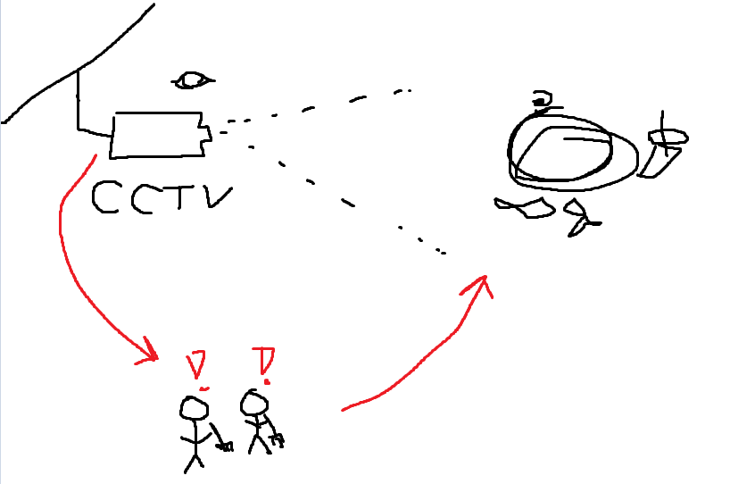

# Jacob Yoo's Blog - ML for Artists Fall 2021

### <em>When you hear the words "Artificial Intelligence, what are the first four things that come to mind?</em>

1. Machine Learning
2. Games
3. Self-driving cars
4. Automated voice assistants

When I hear "Artificial Intelligence" the first things that come to mind are the ways in which AI can be applied:

The first two are things that immediately come to mind whenever AI is brought up, regardless of context. Machine learning is an extremely powerful (and popular) topic in AI, and the most exposure I have to AI is probably in the form of video games.

The third and fourth things (Self-driving cars and Automated voice assistants) come to mind simply because they seem like good examples of how AI can actively be applied to the world around us.

### <em> What are the top three digital services / devices present in your everyday life? </em>

1. Search engines
2. Maps
3. Online shopping

### <em> Have these things ever surprised you by guessing something about you that you didn’t expect? </em>

Search engines have definitely become much sharper at guessing what kinds of things you want to search / would be interested in searching than before. One good example of this is YouTube's search / recommendation algorithm: After watching <em> one </em> video about cooking, YouTube's algorithm unexpectedly immediately recommended a plethora of new cooking-related videos and series.

### <em> Can you identify the ways AI is used in the following list? </em>

1. Email Inbox - Filtering (spam / viruses / other categories), Generating warnings about potential phishing scams / unknown contacts

2. Check depositing - AI Vision i.e. scanning the check for specific fields and translating human handwriting to strings, locating the correct account numbers to carry out the transaction, and actually performing the deposit

3. Texting and mobile keyboards - Autocomplete, spellcheck, word / phrasing suggestions

4. Netflix - Recommendation algorithms

5. Google (Search function) - Filtering (adding in results you are more likely to find useful), autocomplete (based on what other users have searched recently)

6. Social media platforms - Friend recommendations, Group recommendations, post recommendations, etc.

7. Automated message systems - Voice recognition algorithms

### <em> What do we gain by having AI in our everyday lives? </em>

AI ultimately allows us to both save time and 'do' feats we could never normally do on our own. For example, the recommendation algorithms present in search engines allow users to find something useful and relevant to their search quickly and efficiently. Also, machine learning allows users to find algorithms for things so complicated (such as computer vision) we would've never been able to find an algorithm for those things otherwise.

### <em> What do we lose by having AI in our daily lives? </em>

There's always the argument to be made that having AI in our daily lives greatly reduces our privacy. The aforementioned recommendation algorithsm inherently must know a lot about the user in order to draw the conclusions it does on a day-to-day basis. Similarly, AI-assisted map apps need to know your exact location when planning out routes throughout the area. 

### <em> Think about what you have learned so far about what AI is and how it shows up in our daily lives. Identify a problem that you see in your life, neighborhood, or community and design an AI system that could help address this problem </em>

For this exercise, let's look at the problem of littering -- large urban areas especially are all infested with littering and garbage. AI can help solve this issue through many different ways: One way it could help is by identifying areas where trash / litter buildup is especially bad. Human volunteers could then be notified to clean up the specified area before the trash buildup gets even worse. Lots of data involving visual depictions of litter and trash would be needed in order to train the ML models necessary for AI to accurately identify litter. This data could be gathered in a non-intrusive way simply by taking pictures of litter / trash already present in the streets. 

